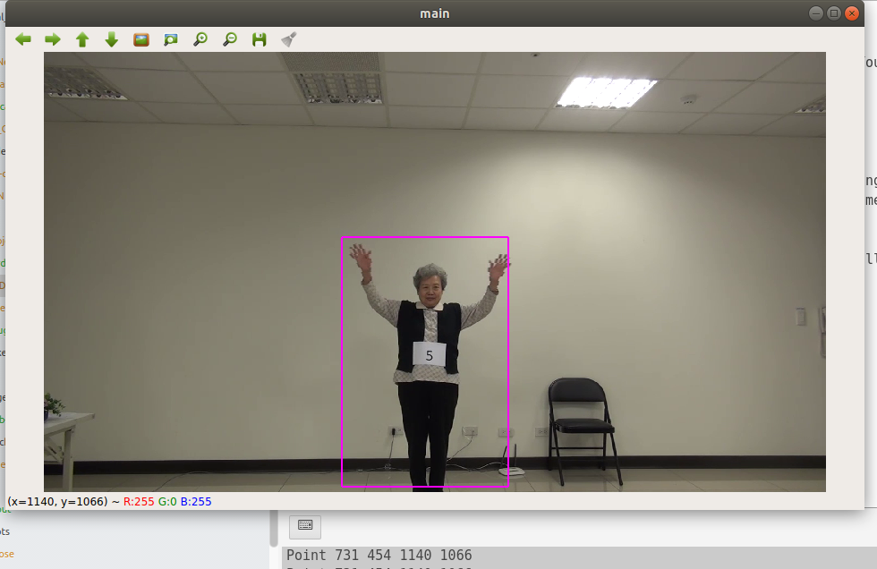

## **CGU_Project**
This is a repositories for laboratories project on SIMSLAB NTUST Taiwan. This repositories use for detect an human action based on human skeleton. The algorithms used in this repositories are  the modified and the combination of [1] and [2]

#### Prerequisites
The dependencies of this model is the combination of [1] and [2]. You can directly use our dependencies in *enviroment.yml*

#### Program
- **Coordinate Extraction**
  - Use to make skeleton detection more accurate and faster by giving the openpose[1] smaller resolution. This is possible if the video frame is too big compare to the object. And the object is not moving.
  - `python coordinate_maker.py video.mp4`
  - the rectangle coordinate shows in terminal which will use manually in openpose
  - 

- **Openpose[1]**
  -

#### DEMO

#### Reference
* [1] CMU-OpenPose :
* [2] ST-GCN :
